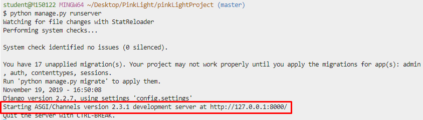

## Project Folder Structure


## Channel 개발 서버

###  channels 패키지를 설치

```bash
$ pip install -U channels
```


### routing.py

- config/ routing.py 파일 생성

  ```
  from channels.routing import ProtocolTypeRouter
  
  application = ProtocolTypeRouter({
      
  })
  ```


### channels  Application 등록 & ASGI_APPLICATION 추가

- config/ settings.py 수정

  ```
  # Application definition
  
  INSTALLED_APPS = [
      'channels',
      'websockets',
      'django.contrib.admin',
      'django.contrib.auth',
      'django.contrib.contenttypes',
      'django.contrib.sessions',
      'django.contrib.messages',
      'django.contrib.staticfiles',
  ]
  
  # Channels
  ASGI_APPLICATION = 'config.routing.application'
  ```

  


- Channels가 websockets Application에 포함되어, 표준 Django 개발 서버를 Channel 개발 서버로 대체한다.

  


